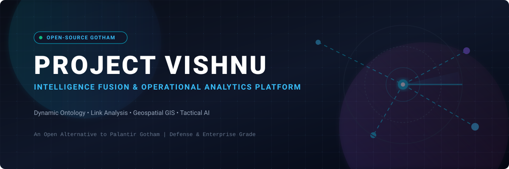
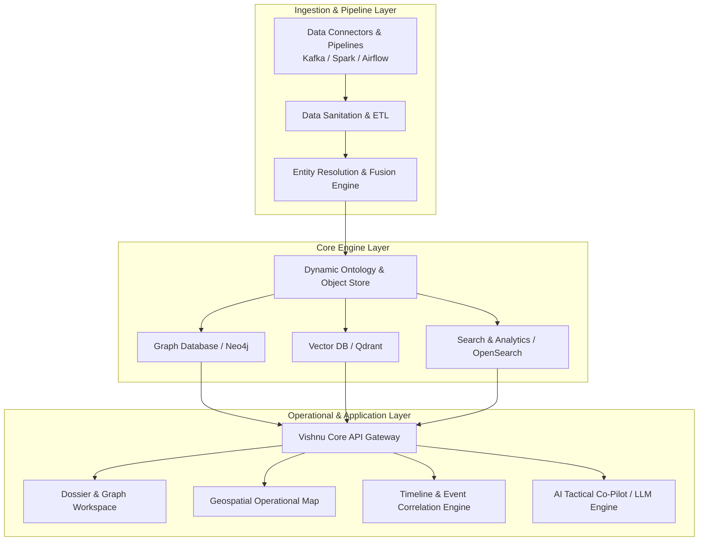

  

# 🔱 Vishnu (openGotham) — Open Source Palantir Gotham Alternative

  
  
  
  
  
  

> 🚀 **Vishnu** is an open-source, enterprise-grade intelligence integration, operational analysis, decision platform, and defense analytics engine — designed as an open-source alternative to **Palantir Gotham**.

---

## 🔍 Key Highlights & Keywords 🔑
- 🛡️ **Palantir Gotham Alternative / Open Source Palantir**
- 🛰️ **Defense Intelligence & Operations Platform**
- 🧬 **Dynamic Ontology & Data Fusion Engine**
- 🗺️ **Geospatial-Temporal Tracking & GIS Mapping**
- 🕸️ **Link Analysis & Interactive Graph Visualizer**
- 🤖 **AI Tactical Co-Pilot & Retrieval-Augmented Generation (RAG)**
- 🔒 **Air-Gapped Enterprise Security (ABAC/RBAC)**

---

## 📌 Executive Summary 📝

**Project Vishnu** bridges the gap between fragmented data sources and tactical/strategic decision-making. Built for intelligence analysts 🕵️‍♂️, defense operations 🎖️, law enforcement agencies 🚔, disaster response teams 🚨, and enterprise risk managers 🏢, Vishnu delivers a unified, ontology-driven operational picture.

By leveraging modern open-source software (OSS) infrastructure ⚡, Vishnu enables multi-source data ingestion 📥, entity resolution 🧩, dynamic graph visualization 📊, geospatial-temporal tracking 🌐, real-time collaboration 🤝, and AI-assisted intelligence synthesis 🧠.

---

## 🏗️ System Architecture & High-Level Components 📐

---

## 🔥 Core Capabilities & Planned Features ✨

### 1. 🧬 Unified Dynamic Ontology & Data Fusion Engine
* ⚙️ **Flexible Schema Configuration:** Custom definitions for Entities (Persons, Organizations, Vehicles, Locations, Objects), Relationships, and Events.
* 🧩 **Automated Entity Resolution:** Rule-based and machine-learning-driven record matching, deduplication, and identity resolution across heterogeneous data feeds.
* 📜 **Data Provenance & Lineage:** Immutable lineage tracking detailing exact origin, confidence scoring, and transformations for every data point.
* 🔐 **Security & Fine-Grained Access Control (ABAC/RBAC):** Object-level, property-level, and classification-based access policy controls (e.g., SECRET, TOP SECRET, Need-To-Know tags).

### 2. 🕸️ Interactive Graph & Dossier Workspace (Link Analytics)
* 🔍 **Link Analysis Visualizer:** High-performance visual canvas for investigating network connections, hidden relationships, and shortest path discovery.
* 📁 **360-Degree Entity Dossiers:** Unified profile views collating historical activities, associated assets, linked entities, communications, and media artifacts.
* 📈 **Network Metrics & Pattern Detection:** Centrality metrics (betweenness, closeness, eigenvector), community detection, and anomaly clustering.

### 3. 🗺️ Geospatial-Temporal Operational Map (GIS Workspace)
* 🌍 **Multi-Layer GIS Integration:** Native support for Vector tiles, Raster data, GeoTIFFs, WMS/WMTS standards, and satellite imagery feeds.
* 🛰️ **Real-Time Asset Tracking:** Low-latency streaming of telemetry data (AIS for maritime, ADS-B for aviation, GPS for ground units, IoT sensor feeds).
* 🚨 **Geofencing & Spatial Alerting:** Dynamic spatial boundaries triggering immediate notifications on unauthorized entry/exit or abnormal movements.
* ⏱️ **Temporal Playback Controls:** Time-scrubbing sliders to visually replay movements, troop deployments, or incident progressions over specific historical windows.

### 4. ⏳ Timeline & Event Correlation Engine
* 📅 **Chronological Event Stream:** Multi-source event aggregation displayed in an interactive timeline view.
* 🔄 **Sequence & Pattern Matching:** Automatic detection of recurring temporal patterns or pre-defined sequence indicators (e.g., suspicious financial transfers followed by travel events).
* 🌐 **Cross-Spectrum Correlation:** Simultaneous correlation of cyber telemetry, physical movements, and communications metadata.

### 5. 🤖 Tactical AI & Natural Language Co-Pilot
* 🧠 **Retrieval-Augmented Generation (RAG):** Natural language querying over structured ontology stores and unstructured document repositories (PDFs, intercepted logs, reports).
* 📑 **Automated Briefing & Intelligence Synthesis:** AI-generated executive summaries, tactical situation reports (SITREPs), and action plan recommendations.
* 🏷️ **Entity Extraction & NLP:** Automatic extraction of named entities (NER), sentiment, and event structures from unstructured text data in multiple languages.

### 6. 🤝 Collaborative Operations & Incident Room
* 🖥️ **Real-Time Multi-User Canvas:** Live co-investigation tools enabling analysts across locations to share graph states, map layers, and annotations simultaneously.
* 📦 **Evidence Management & Dossier Exporting:** Export court-ready or command-ready intelligence packages, interactive HTML reports, and standardized PDF dossiers.
* 📋 **Operational Workflow Management:** Task assignments, target package generation, approval chains, and audit logs.

---

## 🛠️ Open Source Technology Stack 💻

| Category | Open-Source Technology Stack Options |
| :--- | :--- |
| **Frontend / UI Canvas** 🎨 | React, TypeScript, Cytoscape.js / G6, Mapbox GL JS / Deck.gl, Tailwind CSS |
| **Backend & Microservices** ⚙️ | Go / Python (FastAPI) / Rust, GraphQL, gRPC |
| **Graph Analytics Database** 🕸️ | Neo4j, Apache Age, Memgraph |
| **Search & Indexing Engine** 🔍 | OpenSearch, Elasticsearch |
| **Vector DB (AI & RAG)** 🧠 | Qdrant, Milvus, pgvector |
| **Streaming & Data Storage** 💾 | Apache Kafka, ClickHouse, PostgreSQL, MinIO |
| **Orchestration & Infra** 🐳 | Kubernetes, Helm, Apache Airflow |

---

## 🛡️ Enterprise Security & Defense Compliance 🔒

* 🏷️ **Multi-Level Classification Support:** Granular data tagging to isolate sensitive intelligence based on clearance levels.
* 🔑 **Zero Trust & SAML/OIDC Integration:** Seamless integration with Keycloak, Okta, Active Directory, and PKI certs.
* 📋 **Full Audit Logging:** Comprehensive tamper-proof auditing of search queries, data views, downloads, and graph edits.
* 🌐 **Air-Gapped Deployment Support:** Native support for deployment in fully disconnected, air-gapped, and edge computing environments.

---

## 🎯 Target Use Cases 🎯

* 🎖️ **Defense & Intelligence Agencies:** Operational picture aggregation, target package development, threat tracking, situational awareness.
* 🚔 **Law Enforcement & Counter-Terrorism:** Gang network mapping, financial crime tracing (AML), cross-jurisdictional intelligence sharing.
* 🛡️ **Cybersecurity & Threat Intelligence:** Advanced persistent threat (APT) mapping, infrastructure attribution, SOC incident response correlation.
* 🚨 **Crisis & Disaster Response:** Resource deployment tracking, damage assessment mapping, multi-agency coordination during natural disasters.
* 🏦 **Financial Crime & Enterprise Fraud:** Complex fraud ring detection, supply chain vulnerability assessment, insider threat monitoring.

---

## 🛣️ Roadmap & Milestones 🗺️

- [ ] **Phase 1: Core Foundation** 🧱
  - Project setup & architecture RFC
  - Data model & dynamic ontology framework schema setup
  - Basic GraphQL / REST backend API core
- [ ] **Phase 2: Ingestion & Resolution** 📥
  - Batch/stream data ingestion pipelines
  - Rule-based Entity Resolution & Deduplication framework
- [ ] **Phase 3: Visual Analytics Core** 📊
  - Dynamic graph link analysis canvas UI
  - 360-degree Dossier management UI
  - Geospatial map view integration (Deck.gl / Mapbox)
- [ ] **Phase 4: AI & Collaborative Suite** 🤖
  - LLM RAG engine integration over unstructured docs & ontology
  - Real-time collaborative workspace (WebSocket/CRDT)
  - Audit logging, RBAC/ABAC security layer completion

---

## 🤝 Contributing & Community 🌐

Contributions are warmly welcomed! Whether you are an intelligence specialist, software engineer, UI/UX designer, or security expert, you can help shape **Vishnu** into a premier open-source platform.

Please review our upcoming [Contributing Guidelines](CONTRIBUTING.md) before submitting Pull Requests.

---

## 💖 Support & Sponsorship 🌟

If you find this project ambitious, valuable, or interesting, please consider supporting its open-source development!

- ⭐ **Star this repository** to show your support and raise awareness!
- 🍴 **Fork it** to start contributing or building custom extensions.
- 📢 **Share it** with fellow developers, researchers, and intelligence professionals.
- ☕ **Sponsor the developer** by buying a coffee or sponsoring ongoing open-source work via the [GitHub Sponsor Dashboard](https://github.com/sponsors/ishandutta2007).

Thank you for being part of the open-source defense & operational analytics community! 🙏

---

## 📈 Star History 🌟

---

## 📜 License 📄

Project Vishnu is released under the **[Apache 2.0 License](LICENSE)**.
